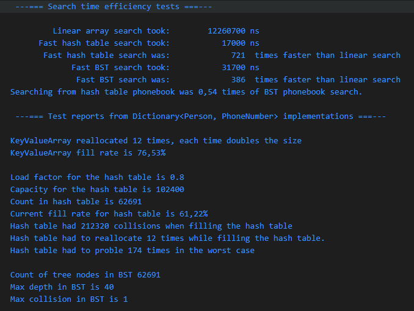
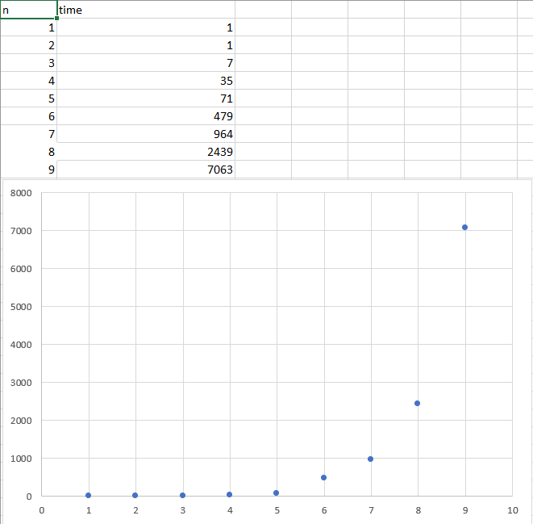
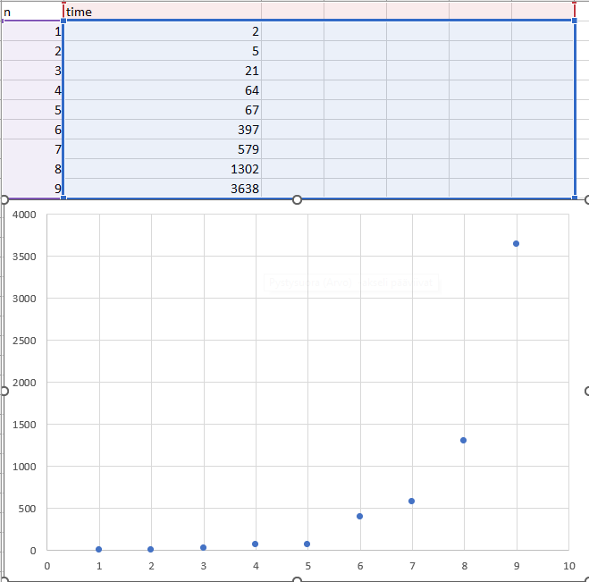

# Kurssitehtävien oppima ja raportit

Kirjoita jokaisesta alla olevasta kurssitehtävästä parilla lauseella miten tehtävän tekeminen sujui ja mitä siitä opit.

Jos tehtävässä pyydetään **raportoimaan** jotain, kirjoita myös nämä raportit tähän dokumenttiin.

## 00-init
Opin gitin käyttöä. En ole ennen käyttänyt git komentoja, joten on mukava päästä käyttämään oikean teollisuuden käytäntöjä ja työkaluja.
Olen itse myös käyttänyt aikaisemmin Eclipsea, joten opin VSC käyttöä, joka tuntuu jo nyt erinomaiselta alustalta.

## 01-arrays
Sain vähän koppia geneerisyydestä. Se taito oli jo vähän päässyt ruostumaan ohjelmointi 2 kurssilta. Tässä tehtävässä pääsin myös ensimmäistä kertaa kunnolla kiinni debuggaamisesta. Olen debugannut koodiani aikaisemminkin, mutta nyt ehkä palaset vasta "loksahtivat" paikoilleen jotenkin.

## 02-mode
Opin aikakompeksisuudesta ja miten paljon eroa voi tehokkuudessa olla samaa tekevässä koodinpätkässä.

Tähän tehtävään liittyy raportti! Lue ohjeet!

Analysoi koodisi aikatehokkuutta eli suoritusaikaa diagrammin muihin mittauksiin ja niistä piirrettyihin viivadiagrammeihin. Tarkastele myös numeerisia arvoja ja kysy itseltäsi mikä mahtaa olla toteutuksen aikakompleksisuusluokka? Tutki koodiasi ja mieti mikä on koodisi aikakompleksisuus? Huomioi kaikki mitä tehdään findMode -metodin sisällä, mukaan lukien muut kutsuttavat omat metodisi. Mikä on tämän perusteella koodisi aikakompleksisuus? Miten se suhteutuu graafiseen esitykseen suoritusajoista n:n koon kasvaessa?

Aika kompleksisuus on ohjelmassani Linearithmic (n log n), koska ohjelma on lajittelu algoritmi ja se on paras, johon tämän lajittelun kanssa pystymme.

Ohjelma lajittelee (sort) arvot ensiksi kasvavaan järjestykseen ja sitten tarkistaa kaikesta järjestelmällisesti tyyppiarvon. Mitä enemmän arvoja niin ohjelman pitää edelleen tarkistaa kaikki arvot, jotta saa oikean tyyppiarvo vastauksen. Ohjelman lopussa se tarkistaa vielä viimeisen arvon, että onko se tyyppiarvo. Ohjelman on käytävä kaikki arvot läpi ja laskea montako niitä on. Aikakompleksisuus on tässä algoritmissä (n * log * n)

Graafisesti tämä näkyy käyränä, joka hitaasti mutta varmasti kasvaa eli mitä enemmän arvoja niin kauemmin kestää sen läpikäymisessä.

## 03-draw
Sain ensikosketuksen predikaatin käytössä. 

## 04-1-stack
Ymmärrän Stack algoritmia nyt ja ymmärrän miten se toimii. Geneerisyyden ymmärrys syventyi hiukan jälleen.

## 04-2-queue
Ymmärrän queue algoritmia nyt ja opin myös Timerin käyttöä. 

## 04-3-linkedlist
Ensimmäinen kosketus LinkedListaan kokonaisuudessaan ja tämän tehtävän avulla opin mielestäni suhteellisen hyvin algoritmin idean. 

## 05-binsearch
Kiinnostavaa luoda uusi nopeampi toteutus verrattuna aikaisempaan. 

## 05-invoices
Quicksortin käyttö oli valaisevaa ja tämä tehtävä auttoi minua ymmärtämään kuinka isoja eroja erilaisten algoritmien nopeudessa on.

## 67-phonebook

Report

BST scatterplot

HashTable scatterplot

minkälaisia hajautusfunktioita kokeilit tiivisteiden laskennassa? Tuliko joillakin enemmän törmäyksiä kuin toisilla hajautusfunktioilla?

V: Kokeilin eri primäärilukuja, erilaisia hajautusfunktioita. Ensimmäisenä kokeilin todella yksinkertaista hajautusfunktiota

Suurimman eron löysin, kun kokeilin myös for looppia.
Tällä hajautusfunktiolla, minun koodini oli tuplasti hitaampi kuin nykyiselläni.

    int result = 5381;
        for(char ch : this.getFullName().toCharArray()) {
            result = (result * 37 + Character.getNumericValue(ch));
        }
    return result;

Tässä nykyinen nopein löytämäni ratkaisu. 

    int result = 5381;

        result = (result << 5) + result + lastName.hashCode();
        result = (result << 5) + result + firstName.hashCode();
        
    return result;

Syy taitaa löytyäkkin noista getFullName tms. metodien kutsunnoista. Tykkäsin omasta simppelistä ja nopeasta ratkaisustani vaikka törmäyksiä tulikin aika paljon.

hajautustaulujen kanssa, minkälaisilla täyttöasteilla (fill factor) kokeilit taulukkoa? Nopeutuiko tai hidastuiko käyttö erilaisilla täyttöasteilla?

V: Kokeilin pienimpänä 0.5 loadfactoria ja korkeimpana 0.95. Load factor 0.8 jäi sitten käyttöön, kun sillä näytti tulevan hyvä tasapaino nopeuden kanssa ja se myös vähensi turhia taulukon kavatuksia ja törmäyksiä. esim. 0.95 loadfactorilla alkoi kestämään jo pidempää sen takia kun tuli niin paljon törmäyksiä. 

kuinka paljon kasvatit hajautustaulun kokoa aina kerralla kun reallokointia tarvittiin? Nopeuttiko eri ratkaisut toimintaa ja/tai tuliko taulukosta tarpeettoman iso ja muistia tuhlaava (suurin osa siitä jäi tyhjäksi)?

V: kasvatin taulukkoa aina 2x, jotta sille tulisi varmasti riittävästi tilaa ja jottei ohjelman tarvitsisi olla kokoaikaa kasvattaa taulukkoa. 2x vaikutti olevan hyvä ratkaisu, koska se oli nopea mutta lopussa se saattaa rohmuta vähän liikaa muistia, koska joskus taulukkoon jää tyhjää tilaa.

kuinka syväksi puu muodostui eri hajautusfunktioilla, vai oliko niillä merkitystä? Kokeilitko erilaisia hajautusfunktioita?

V: No esimerkiksi phonebooktestissä puun syvyys oli 40. Hajautusfunktion muuttaminen for looppiin hidasti koodia, vaikka pienensi puun syvyyttä. Päätin ottaa syvemmän mutta nopeamman puun.

Millä tavoin hoidit törmäykset hajautustaulussa ja BST:ssä? Kokeilitko erilaisia vaihtoehtoja, ja miksi valitsit sen mikä jäi toteutukseen?

V: BST:ssä hoidin törmäykset omalla LinkedListImplementatiolla, joka vaikutti toimivan erinomaisesti. Hajautustaulussa oli käytössä probing. En kokeillut muita vaihtoehtoja, koska nämä toimivat minulle riittävän hyvin.

Tietorakenteiden toteutuksiesi pitää sisältää metodi getStatus(), joka tulostaa tietoa tietorakenteiden toiminnallisuudesta ja toteutuksesta. Mitä tässä tulostat ja miten mielestäsi palauttamasi toteutukset ovat parempia kuin muut kokeilusi, näiden tietojen perusteella mitä tulostat tuossa metodissa? Mitä voit sanoa näistä tulostetuista asioista suhteessa siihen mitä tässä olet analysoinut?

V: Molemmissa toteutuksissa tulostan testattavan materiaalin määrän "count", molemmissa tulostan myös kuinka paljon tilaa minun ohjelma varaa eli BSTssä tulostan puun maksimi syvyyden ja Hashtablessa tulostan kuinka suuri taulukkoni on ja kuinka suuri osa taulukosta on täytetty prosentteina. Näiden avulla saa hyvän kuvan, että onko toteutukseni järkevä, esim onko hajautustaulun lopullinen fill percentage joku tajuttoman alhainen. Silloin tiedän, että minun pitää uudelleen miettiä taulukon kasvattamistani.

Minkä lajittelualgoritmin toteutit 05-invoices harjoituksessa, ja käytit tässä? Kokeilitko olisiko joku toinen lajittelualgoritmi tehokkaampi tämän aineiston kanssa? Olisiko heapsort ollut nopeampi kuin quicksort? Pitikö pinon tai kekomuistin kokoa kasvattaa jotta algoritmit ja tietorakenteet toimisivat?

V: Quicksorttia. Quicksort on nopeampi, heapsortilla olisi tullut hitautta kun data määrät kasvaa eli isoimmissa testeissä se olisi ollut huomattavasti hitaampi. Edes quicksortilla, minun ei tarvinnut kasvattaa muistini määrää ohjelmalle. 

Lopuksi, anna myös palautetta kurssista, kurssin tehtävistä ja kommentoi kurssin oppimistavoitteiden saavuttamista omalta kohdaltasi. Kerro myös mitä kurssilla voisi mielestäsi muuttaa jotta se olisi parempi.

V: Olin positiivisesti yllättynyt kurssin rakenteeseen. Olen iloinen että pääsin oppimaan tira kurssilla kurssin aiheiden lisäksi myös perus juttuja kuten gitlabin käyttöä. Parannusehdotus: olisi kiva saada pisteistä hajua, eli miten mennyt tehtävät pisteiden osalta? 

## Valinnaiset tehtävät

Jos teit jotain valinnaisia tehtäviä, mainitse se täällä että ne tulevat varmasti arvioiduksi.

# Yleistä koko kurssista ja kurssin tehtävistä

Yleistä palautetta ja kehitysehdotuksia, kiitos!